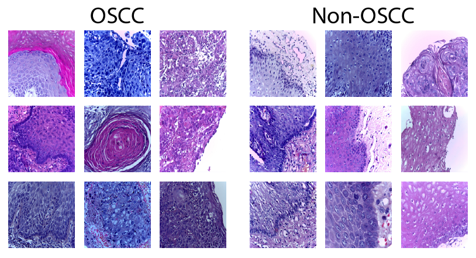
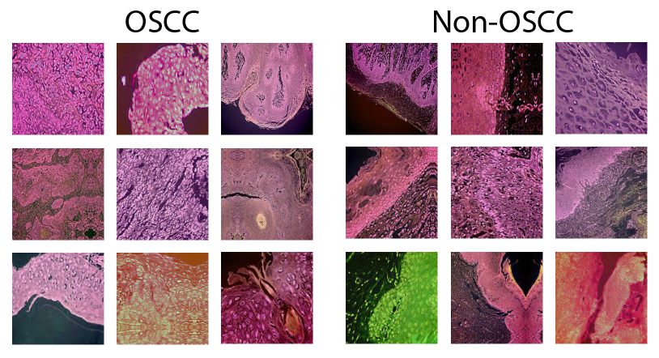
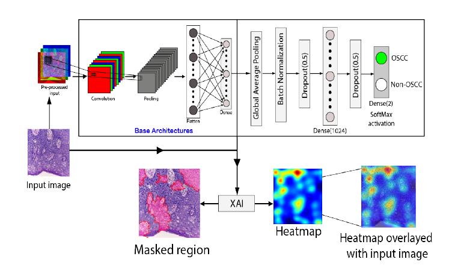
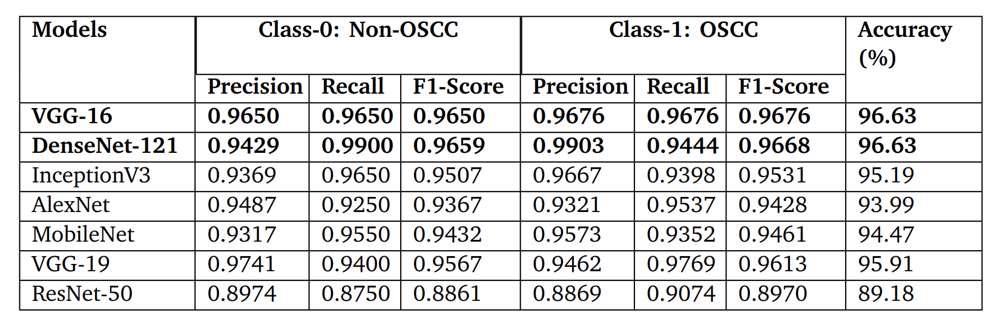
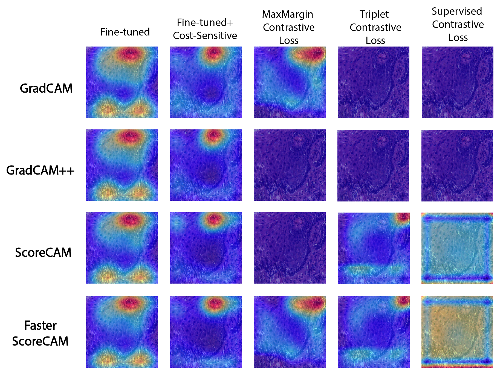
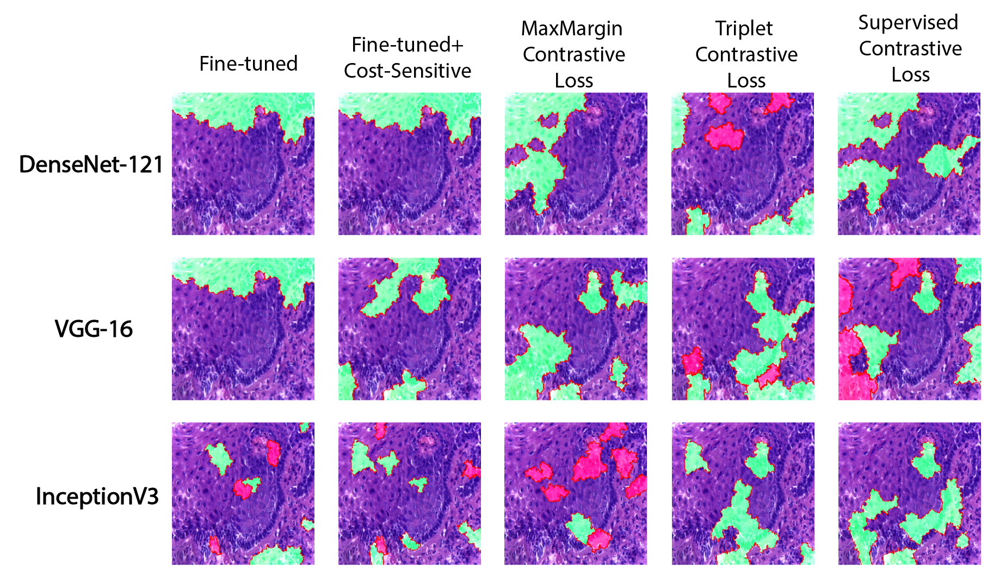

# **XAI BASED OSCC DETECTION SYSTEM**

<h3>N.B:- In anticipation of publishing our paper, we have maintained confidentiality of our codes and in depth detailings until the time of publication.</h3>

<h2><code style="color:blue">Problem Statement</code></h2>
<strong>Using histopathological images, this research aims to develop an explainable AI-driven
model that combines Convolutional Neural Networks (CNNs) with interpretable techniques. The goal is to enable accurate and transparent classification of oral squamous cell carcinoma (OSCC), providing clinicians with interpretable insights into the model’s decision-making process and enhancing trust, confidence, and clinical acceptance in OSCC diagnosis.
</strong>

<h2><code style="color:blue">Objective</code></h2>
<strong>The question is, can we really rely on an artificial intelligence system which will give
a yes or no answer, without knowing why or how the answer is being given? We believe
the answer is a pretty strict no. Because, one the first hand, many of the normal people
aren’t really aware clearly, what an AI system is, and secondly, even many technical people
don’t have a clear idea about how an answer is being generated in a model. This is where
the major motivation of the work came from. If a model can give an answer about whether
anyone has cancer or not, it also should be able to say “why” such an answer is being given.
We aim to do exactly this with our built model.</strong>

<strong>ere, we tried to train out CNN models with a dataset that contains histopathological imaages. After the training session completed, the last layer of the CNN model was implemented with XAI models. Explainable AI generates a visual system that clearly indicates the reasoning in favor of the given result.</strong>

<h2><code style="color:blue">Dataset</code></h2>
<strong>For grading cancer, histopathological image analysis is frequently performed all around the
world. Histopathology slides offer more detailed diagnosis information than mammography,
CT, and other imaging tests. It is among the cheapest morphological techniques. Rapidly
and with little risk to the patient, samples can be obtained to make the images. As a good
dataset is significant for the practical outcome of any model, in fields like cancer detection,
histopathological images have proved their competency before. Due to that, we used a
publicly available dataset to detect cancer in the oral squamous cell. The dataset is called
"Oral cancer histopathological dataset". </strong>

    
    <strong>
Images from the OSCC Dataset
</strong>

<strong>To enrich the training data, increase model generalization, improve robustness, and mitigate some issues, we performed a few augmentation techniques on the stratified samples. </strong>

    
    <strong>
Samples from the augmented dataset
</strong>

<h2><code style="color:blue">Methodology & Experimentations</code></h2>
<h3>Training approaches used: -</h3>
<ul>
            <li><strong>Fine-tuning</strong></li>
            <li><strong>Cost-Sensitive Approach</strong></li>
            <li><strong>Contrastive Learning Approach</strong></li>
            <ul>
                <li><strong>Triplet contrastive Loss</strong></li>
                <li><strong>Max-Margin contrastive Loss</strong></li>
                <li><strong>Supervised contrastive Loss</strong></li>
            </ul>
</ul>

<h3>CNN based models used to train: -</h3>
<ul>
            <li><strong>AlexNet</strong></li>
            <li><strong>DenseNet-121</strong></li>
            <li><strong>InceptionV3</strong></li>
            <li><strong>MobileNetV2</strong></li>
            <li><strong>ResNet-50</strong></li>
            <li><strong>VGG-16</strong></li>
            <li><strong>VGG-19</strong></li>
</ul>

     
    <strong>Architecture of the fine-tuned approach</strong>

<strong>During the training process, we employed a strategy of freezing and unfreezing certain
layers to achieve better results. This approach allowed us to
selectively update the weights of specific layers while keeping others frozen. By controlling
which layers were trainable, we aimed to strike a balance between leveraging pre-trained
knowledge and allowing the model to adapt and learn new representations for the specific
task at hand. Subsequently, various XAI (Explainable Artificial Intelligence) techniques were
applied to assess the interpretability of the models.</strong>

<h2><code style="color:blue">Model Evaluation</code></h2>

    
    <strong>
The performance of the fine-tuned models on individual class along with accuracy
</strong>

<strong>For our experiments, we utilized fine-tuned settings for all models except for AlexNet, which
was trained from scratch. The training process for each model required multiple epochs to
reach convergence. Among the models, VGG-16 and DenseNet-121 demonstrated the most favorable results,
while ResNet-50’s performance was unsatisfactory. AlexNet did not exhibit the best performance either, while the results for the remaining models fell somewhere in between.
Given the imbalanced nature of our dataset, we observed a noticeable difference between
the precision and recall values for both classes in all models, except for VGG-16.
</strong>

<h2><code style="color:blue">Model Interpretation</code></h2>

<h3>XAI techniques used: -</h3>
<ul>
    <li>
        <strong>Gradient based methods:</strong>
        <ul>
            <li><strong>Grad-CAM</strong></li>
            <li><strong>Grad-CAM++</strong></li>
        </ul>
    </li>
    <li>
        <strong>Gradient free methods:</strong>
        <ul>
            <li><strong>Score-CAM</strong></li>
            <li><strong>Faster Score-CAM</strong></li>
        </ul>
    </li>
        <li>
        <strong>Perturbation based method: LIME</strong>
    </li>
</ul>

     
    <strong>XAI methods applied on VGG-16 for a correctly classified ’OSCC’ image</strong>

<strong>For the fine-tuned versions of VGG-16 and its cost-sensitive variations, all XAI methods identified the keratin pearl as a crucial factor in determining the "OSCC" class. In the
case of contrastive learning, the version trained with max-margin loss yielded interpretability with grad-cam and faster-scorecam methods. The scorecam and its updated version
produced consistent pixel contributions for the triplet loss. In the supervised contrastive
loss scenario, every pixel seemed to play a role in declaring the class.</strong>

     
    <strong>
LIME applied on all models for a correctly classified ’OSCC’ image
</strong>

<strong>Different models and their versions were evaluated for their ability to classify images as ’OSCC’. The evaluation involved analyzing the contribution of positive and negative
superpixels in determining the class.</strong>

<h2><code style="color:blue">Conclusion</code></h2>
<strong>We have explored three distinct approaches in our models: fine-tuning, cost-sensitive learning, and contrastive learning. Each technique yielded varying outcomes, with some models
exhibiting improved performance through fine-tuning, while others benefited from class weight adjustments. Similarly, different contrastive loss functions resulted in different levels
of performance. Through the application of Explainable AI, we have generated visualizations that highlight the models’ behavior. These visualizations have revealed that certain
models excel at identifying smaller portions, while others struggle to locate crucial areas.
Notably, the perturbation-based technique known as LIME has demonstrated superior visualization capabilities compared to other methods.</strong>

