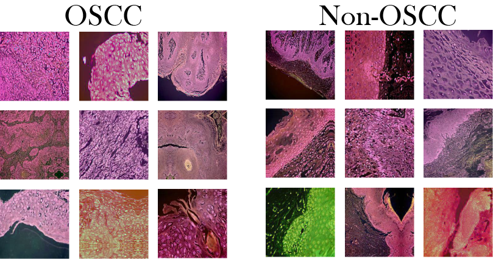
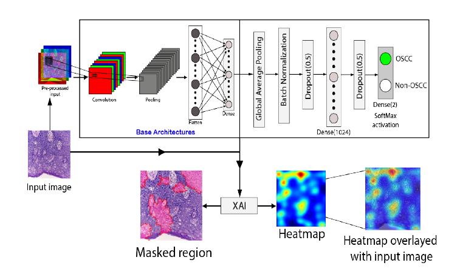
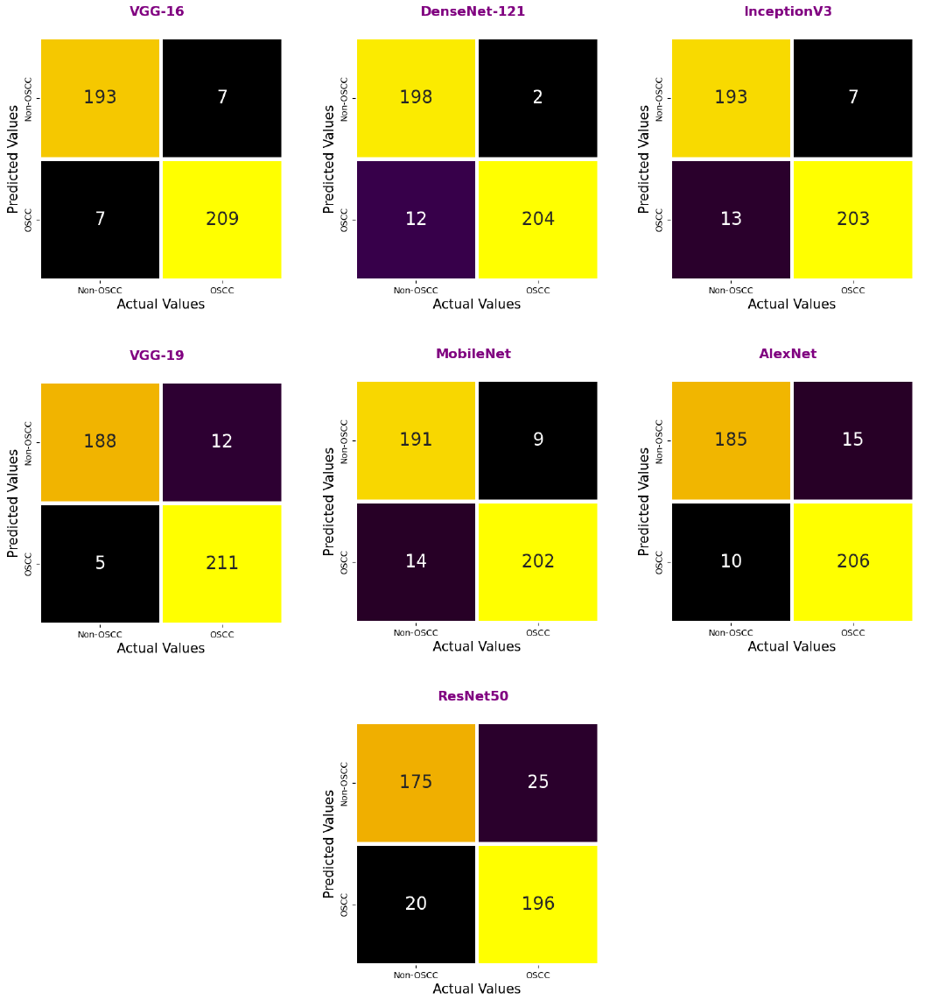
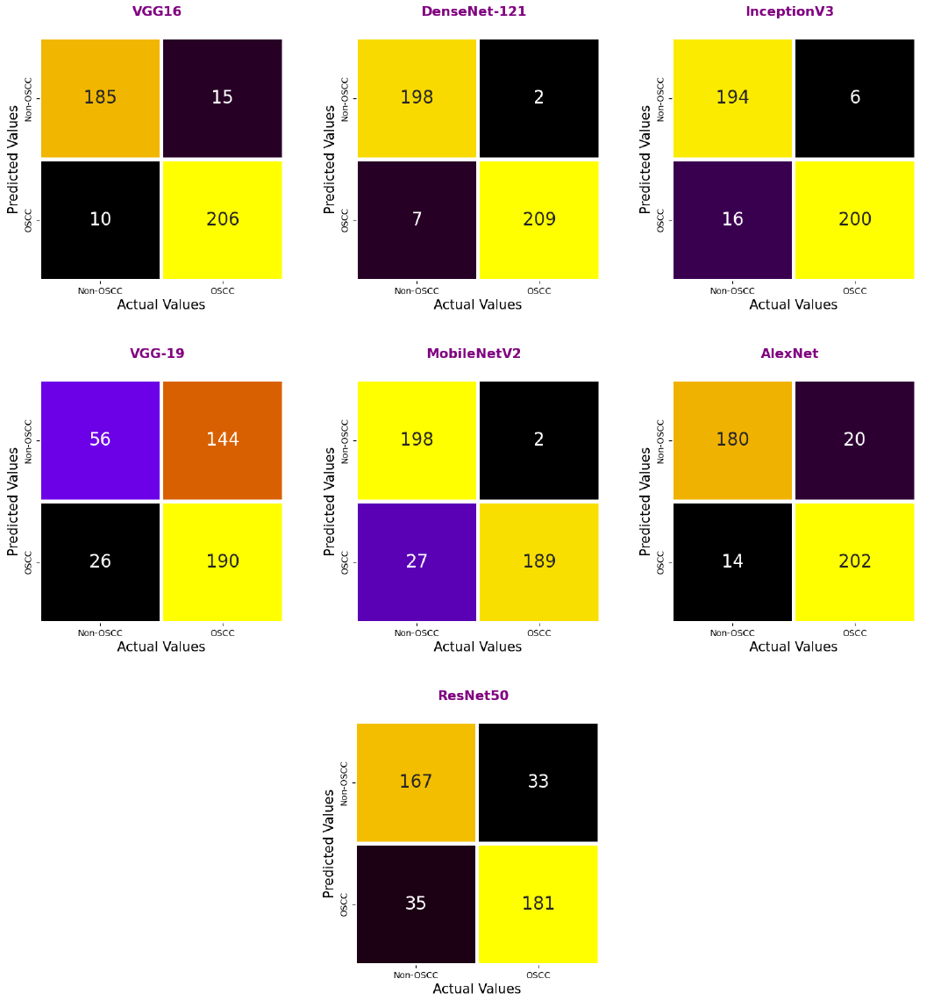
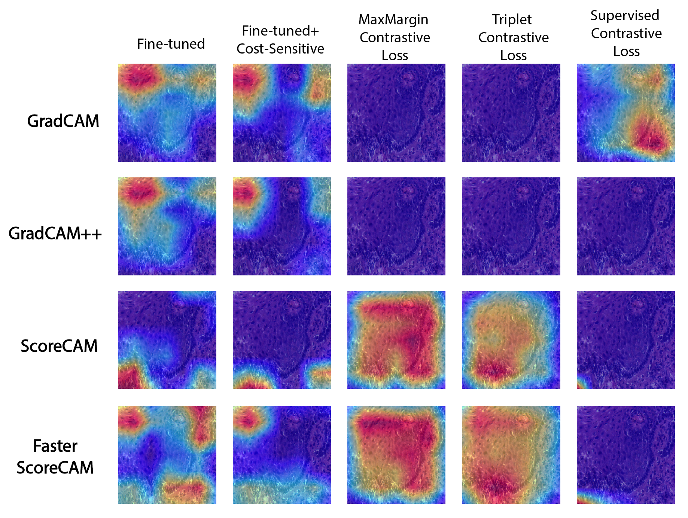
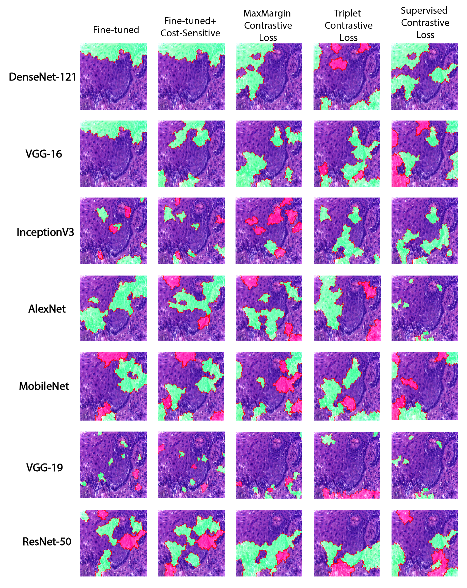

# **XAI BASED OSCC DETECTION SYSTEM**

<h1>N.B:- In anticipation of publishing our paper, we have maintained confidentiality of our codes and other things until the time of publication.</h1>

<h2><code style="color:blue">Problem Statement</code></h2>

<h2><code style="color:blue">Objective</code></h2>

<h2><code style="color:blue">Dataset</code></h2>

    

    

<h2><code style="color:blue">Methodology & Experimentations</code></h2>
<h3>Training approaches used: -</h3>
<ul>
            <li><strong>Fine-tuning</strong></li>
            <li><strong>Cost-Sensitive Approach</strong></li>
            <li><strong>Contrastive Learning Approach</strong></li>
            <ul>
                <li><strong>Triplet contrastive Loss</strong></li>
                <li><strong>Max-Margin contrastive Loss</strong></li>
                <li><strong>Supervised contrastive Loss</strong></li>
            </ul>
</ul>

    

<h3>CNN based models used to train: -</h3>
<ul>
            <li><strong>AlexNet</strong></li>
            <li><strong>DenseNet-121</strong></li>
            <li><strong>InceptionV3</strong></li>
            <li><strong>MobileNetV2</strong></li>
            <li><strong>ResNet-50</strong></li>
            <li><strong>VGG-16</strong></li>
            <li><strong>VGG-19</strong></li>
</ul>

<h2><code style="color:blue">Model Evaluation</code></h2>

    

    

<h2><code style="color:blue">Model Interpretation</code></h2>

<h3>XAI techniques used: -</h3>
<ul>
    <li>
        <strong>Gradient based methods:</strong>
        <ul>
            <li><strong>Grad-CAM</strong></li>
            <li><strong>Grad-CAM++</strong></li>
        </ul>
    </li>
    <li>
        <strong>Gradient free methods:</strong>
        <ul>
            <li><strong>Score-CAM</strong></li>
            <li><strong>Faster Score-CAM</strong></li>
        </ul>
    </li>
        <li>
        <strong>Perturbation based method: LIME</strong>
    </li>
</ul>

    

    

    

<h2><code style="color:blue">Conclusion</code></h2>

